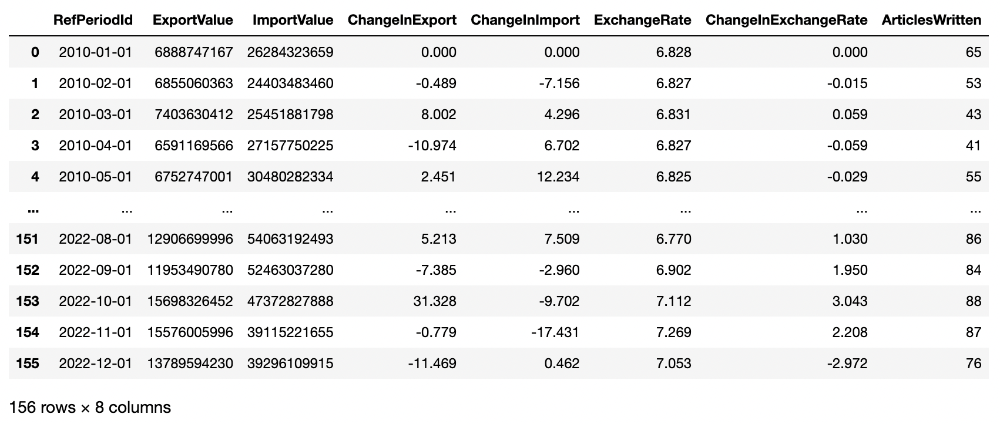
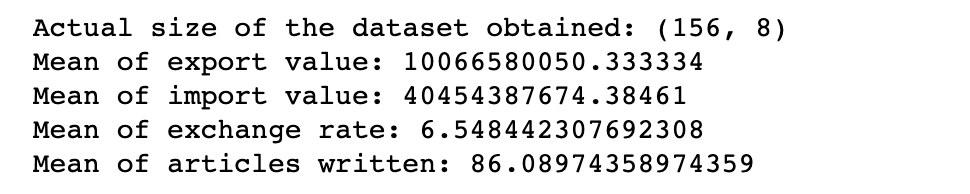
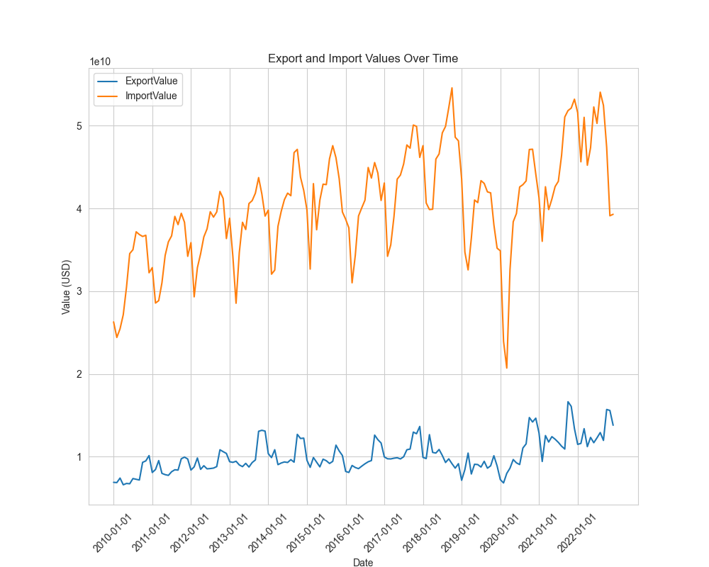
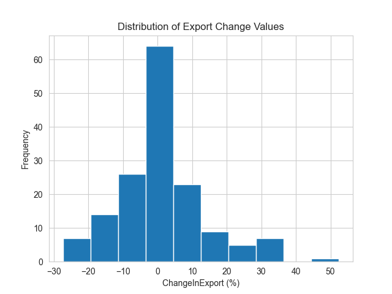
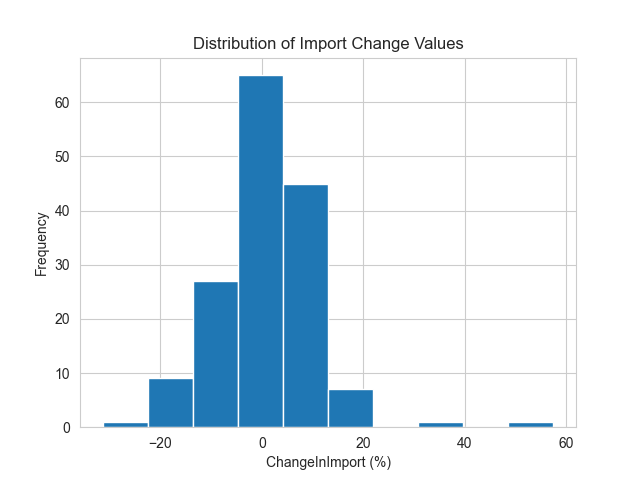
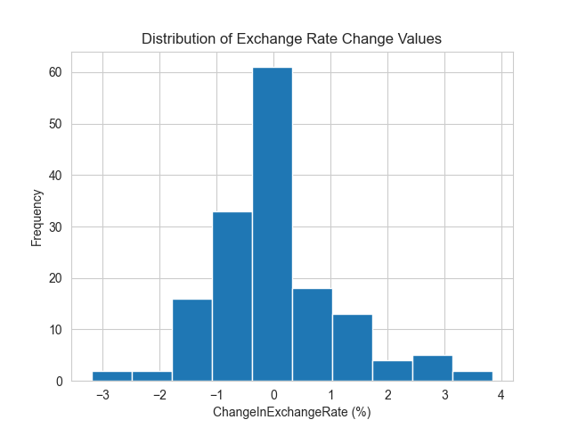
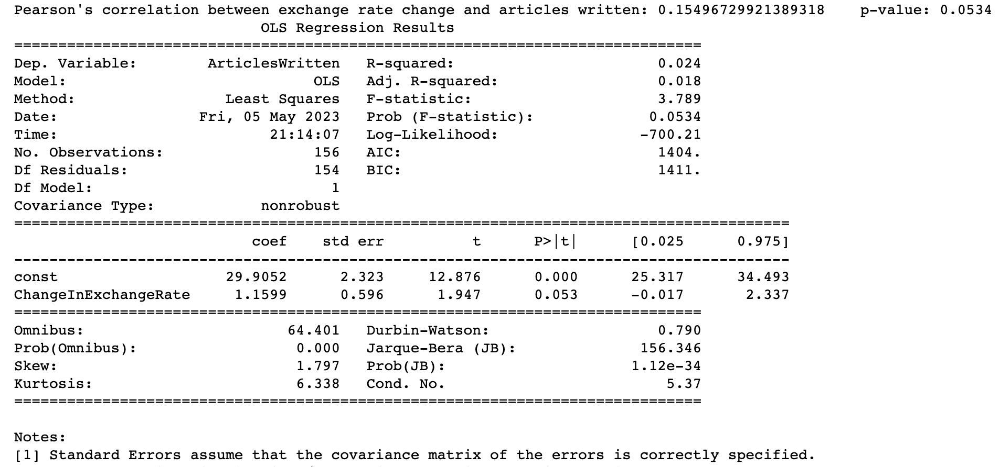
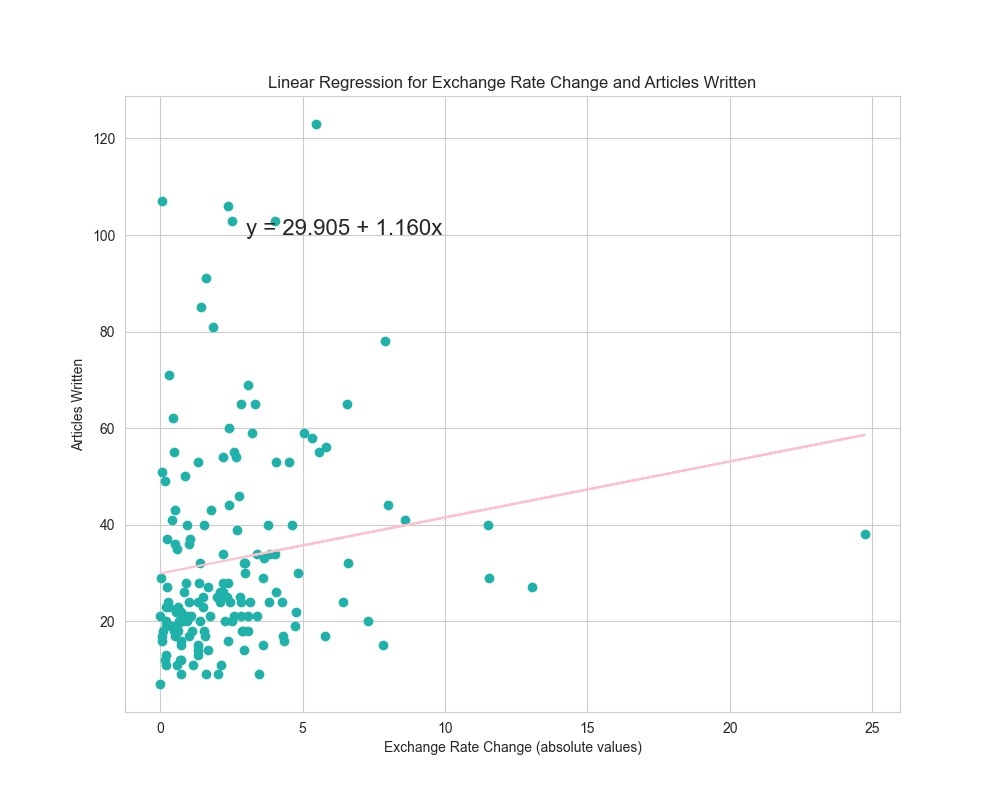
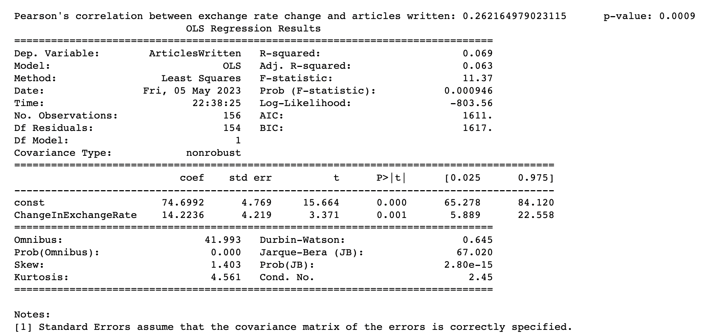

# DSCI 510 Final Project

### Table of Contents
- [Description](#description)
- [Requirements](#requirements)
- [Data Sources](#data-sources)
- [Running the Code](#running-the-code)
- [Analyses](#analyses)
- [Further Extensibility](#further-extensibility)
- [Maintainability and Drawbacks](#maintainability-and-drawbacks)
- [Conclusion](#conclusion)

### Description
The aim of the project is to look at the relationship between trade, exchange rate, and news coverage between the United States and China.

As an international student, I always keep a close eye on the currency exchange rates for the US Dollar and the Chinese Yuan as economic changes cause them to constantly fluctuate. I am concerned with how fluctuations in trade such as export and import values are correlated with fluctuations in exchange rate between the United States Dollar and Chinese Yuan. For instance, economic theory says that an appreciation of a currency makes exports more expensive and imports less expensive, and countries will adjust accordingly. However, is this behavior observed in real life?

Additionally, fluctuations in trade and exchange rate might be indicative of activities happening between the two countries, such as growing tensions or new collaborations. To explore this, I am taking the amount of news coverage provided on trade between the two countries as an indicator of the extent of interaction between them.

I generated a final dataset in the form of a csv file called "dsci_510_dataset.csv". The dataset is created by using three different data sources listed below in the Data Sources section. My starting files are within the folder "uncomtrade_datasets", and the intermediate file is "compiled_trade_data.csv". I will use the data in my intermediate file to perform web scraping and API request operations, then merge all data together for the final dataset csv file. All aforementioned files are available within the datasets directory.

After collecting the data, I performed a series of linear regression analyses on the results. I also generated graphs such as histograms, line graphs, and scatter plots, which are saved into the folder "visualization_imgs". Additionally, I evaluated the results of the significant regression analysis against another set of data collected with a different sample to see if the trend continues.

### Requirements
The system must be able to run python3.

The following packages need to be installed before executing the code:
1. pandas
2. requests
3. BeautifulSoup
4. matplotlib
5. statsmodels
6. seaborn

To install the above packages, please run the following command in the terminal: 
`pip install -r requirements.txt`

The following modules must be imported before executing the code:
1. sys
2. os
3. pandas as pd
4. requests
5. BeautifulSoup
6. calendar
7. re
8. math
9. matplotlib
10. statsmodels
11. scipy
12. numpy
13. seaborn

### Data Sources
1. [UN Comtrade Database](https://comtradeplus.un.org/)
The UN Comtrade website allows access to export and import values per month for goods between the United States and China, as reported by the United States. This allows a good look at trade between the two countries.
On a basic user account, the user is only allowed to show results for 12 months of trade data at a time, so I downloaded several separate files for export and import statistics between the years 2010-2022, with each file containing trade data for a year. These files are saved into the directory "uncomtrade_datasets", where my program will compile them into one trade dataset later on.
2. [CurrencyBeacon API](https://currencybeacon.com/api-documentation)
This is an API that returns historical exchange rates for the Chinese Yuan in reference to the United States Dollar (USD). For instance, a value of 6.5 means that 1 USD = 6.5 CNY. Using the requests library, I queried the API for the first of each month in the trade dataset and used the return JSON object to get the exchange rate. *Note: I removed my personal API key for usage limit reasons. Please register for an API key and replace it in the code if you would like the application to query the API. The code will still run without the API key via using backup data.*
3. [The New York Times](https://www.nytimes.com/)
I am performing a search on The New York Times website for relevant articles with keyword "US China Trade" within each given time period in the trade dataset. For instance, a url for August 2022 would be [https://www.nytimes.com/search?dropmab=false&endDate=20220831&query=us%20china%20trade&sort=best&startDate=20220801](https://www.nytimes.com/search?dropmab=false&endDate=20220831&query=us%20china%20trade&sort=best&startDate=20220801), which displays 86 articles for keyword "US China Trade" between August 1 and August 31, 2022. I am scraping the total number of articles found from the search for each month.

Here is what the final dataset looks like:

### Running the Code
The code can be run in three modes: default, scrape and static. It is recommended to run the code in default mode first, then either scrape mode or static mode. However, this is not necessary.

1. **Default mode**: To run the code in default mode, type command - `python3 Alison_Huang_HW5.py`
 In this mode, the program performs compiling of trade data into one trade dataset file, and then uses the monthly periods given from the trade dataset to scrape data from The New York Times and query the currency API. All the data is then merged into a single dataset. The final dataset is saved to the file "dsci_510_dataset.csv" in the same directory. The first 5 results for largest positive change in exchange rate is printed to the user. This should take around 6 minutes to run.
 Next, the program performs linear regression analyses as well as produces graphical visualizations. Using the significant relationship found in linear regression, it also compares it against a different sample of US Mexico trade, exchange rate, and news coverage to see if the same correlation is also observed.
 This should take around 10 minutes to run.

2. **Scrape mode**: To run the code in scrape mode, type command - `python3 Alison_Huang_HW5.py --scrape`
 In this mode, only 5 of the most recent available months are taken from the intermediate trade dataset and are used for web scraping and API request purposes. These results are generated and printed at each step, along with their size. This should take around 1 minute to run.

3. **Static mode**: To run the code in static mode, type command - `python3 Alison_Huang_HW5.py --static datasets/dsci_510_dataset.csv`
 In this mode, the code reads the "dsci_510_dataset.csv" dataset that was generated using default mode. It prints the dimensions of the whole dataset, a few descriptive statistics, as well as actual data for the 5 most recent available months.
 It also performs analysis and graphical visualizations, if the user does not want to spend time running default mode. This should take around a few seconds to run.
 This should take around a few seconds to run.

### Analyses
Here are some analyses generated from the final dataset.

*Some descriptive statistics:*

A line graph that uses data from the first dataset on trade data to graph how export and import values changed over time from 2010 to 2022:

Using the first dataset (trade data) and second dataset (exchange rate), I looked at the distribution of the percentage of change in the values from one month to the other. All three graphs are relatively normally distributed with a right skewed distribution. The three graphs can be seen below:

The table below shows linear regression analysis for variables in the final dataset. There was a very weak, posiVve relaVonship between export value change and exchange rate change, and import value change and exchange rate change. However, the p-values for both are higher than 0.05 level significance, so no significant observations can be drawn.

| Variable 1           | Variable 2           | Pearson's correlation| p-value              |
| -------------------- | -------------------- | -------------------- | -------------------- |
| Export value change  | Exchange rate change | 0.0088               | 0.9127               |
| Export value change  | Exchange rate change | 0.0741               | 0.3577               |
| Exchange rate change | Articles Written     | 0.2622               | 0.0009               |

The relationship between exchange rate change and articles wri\written was significant. I took the absolute value of the exchange rate change because I am mainly concerned with the scale of change rather than the direcVdirectionon of change. There is a significant weak positive relationship with a Pearson’s correlaVon coefficient of 0.2622, p = 0.0009. This suggests that a larger fluctuation in the exchange rate is related to an increase in the number of articles written on trade relations between the US and China. The scatter plot below also has a line of best fit signifying the correlation.

Since there was a significant correlation between exchange rate change and articles written, I was interested in evaluating the relationship against a different sample to see if the trend continued. To do so, I ran data collection and processing on US and Mexico, since Mexico is another big trading partner of the US. The linear regression analysis between the variables of exchange rate change and arVcles written also showed a positive correlation, although it was weaker than the one observed between US and China at 0.1550. The p-value was 0.0534, which is not statistically significant at 0.05 significance level by a small margin.

### Further Extensibility
The code can be extended to analyze trade between other countries or more countries. For instance, Canada and Mexico are two more of the US' top trade partners. We can conduct further analyses with more countries in order to collect more tests and see if a solid relationships can be drawn between import and export values, exchange rates, and news popularity.

Furthermore, instead of just getting the number of articles written each month with the keyword on The New York Times, we can scrape the headline and the article descriptions and conduct a sentiment analysis to analyze overall feelings about trade relations that month.

### Maintainability and Drawbacks
The currency exchange rate API that I am using is on the free plan which has a limit of 5000 requests per month. A request has to be sent for each monthly period to get information on historical requests. If the dataset grows larger or the code is executed many many times, the code will break as no more requests are allowed by the API.

The API is sometimes unresponsive. To handle it, I have a backup exchange_rate.csv file within the datasets folder, which has already been prepopulated with exchange rates from previous API calls. If the API is unresponsive, then I will use the backup file instead. However in the event this happens, please execute the code again once the API is back up to be able to see how the complete program is meant to run!

The code scrapes the number of articles from The New York Times based on the keyword "US China Trade". The keyword is relatively simple and may not grab all articles that have to do with trade relations that month, or it may grab unrelated articles. The New York Times is also only one news source out of many in the United States. Therefore, the news metrics gathered may not offer a comprehensive look at what happened that month.

### Conclusion
Exchange rate change and news coverage are significantly and positively correlated. There is no relationship observed between import and export changes and exchange rate changes, suggesting that the economic theory stating that fluctuations in currency value and trade values are related is more nuanced. There are many other extraneous variables that may influence how countries operate, and changes in trade and exchange rate may also take months and years to take effect and reflect in the data instead of one month. We can conduct further multi regression analysis research on these extraneous variables.